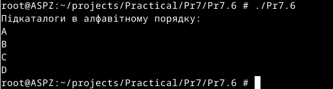

# Практична робота №7
Цей репозиторій cтворений для перегляду виконання практичної роботи №7 з дисципліни "Архітектура системного програмного забезпечення", виконане студентом Щур Р.І., групи ТВ-32.

## Завдання №1
Використайте popen(), щоб передати вивід команди rwho до more (команди UNIX) у програмі на C.

## Виконання

Використовуючи popen(), створено два канали зв'язку: перший для виконання команди rwho, а другий - для виконання команди more з використанням результату виконання першої команди.Так як в системі ніхто не залогінений, крім рута, rwho нічого не виводить, а more просто показує звичайний екран вивід.

## Завдання №2
Напишіть програму мовою C, яка імітує команду ls -l в UNIX — виводить список усіх файлів у поточному каталозі та перелічує права доступу тощо.

## Виконання

Відкриття поточної директорії відбувається за допомогою opendir(). Цикл while та функція readdir() використовується для перебору кожного елементу директорії. Для кожного елементу функція stat() отримує детальну інформацію. Отримана інформація передається у функцію print_permissions(), яка виводить, чи є права на читання, запис та виконання.

## Завдання №3
Напишіть програму, яка друкує рядки з файлу, що містять слово, передане як аргумент програми.

## Виконання

Програма перевіряє, чи всі аргументи командного рядка передані. Ім'я файлу отримується з першого аргументу, програма відкриває цей файл і перевіряє, чи успішно він відкрився.Цикл ітерується по кожному рядку файлу і за допомогою функції strstr() перевіряє, чи міститься шукане слово (отримане з другого аргументу) в поточному рядку. Якщо шукане слово знайдено, то цей рядок виводиться на екран.

## Завдання №4
Напишіть програму, яка виводить список файлів, заданих у вигляді аргументів, з зупинкою кожні 20 рядків, доки не буде натиснута клавіша (спрощена версія утиліти more в UNIX).

## Виконання

Програма приймає імена файлів як аргументи командного рядка. Використовуючи цикл, програма виводить кожен рядок окремо. Після кожної ітерації, змінна, яка відповідає за кількість виведених рядків, збільшується, поки не досягне ліміту, після чого програма призупиняє вивід і чекає на натискання клавіші Enter для продовження або клавіші q для виходу. Також в програмі реалізовано декілька перевірок на кількість аргументів командного рядка та коректність відкриття файлу.

## Завдання №5
Напишіть програму, яка перелічує всі файли в поточному каталозі та всі файли в підкаталогах.

## Виконання

Функція list_files() відкриває директорію використовуючи функцію opendir(), зчитує її вміст, і для кожного елементу будує повний шлях. Потім за допомогою stat() отримується інформацію про запис. Якщо запис є звичайним файлом, то виводить його повний шлях на екран. Якщо запис є директорією, то рекурсивно викликається функцію list_files() для цієї піддиректорії.

## Завдання №6
Напишіть програму, яка перелічує лише підкаталоги у алфавітному порядку.

## Виконання

opendir() відкриває поточну директорію ,цикл while та функція readdir(), перебирає кожний елемент. Для кожного запису за допомогою stat() визначається, чи є він піддиректорією. Якщо запис є піддиректорією, її назва додається до масиву.Після завершення сканування директорії, масив directories сортується в алфавітному порядку за допомогою функції qsort(), використовуючи функцію compare_dir_entries() для порівняння.

## Завдання №7
Напишіть програму, яка показує користувачу всі його/її вихідні програми на C, а потім в інтерактивному режимі запитує, чи потрібно надати іншим дозвіл на читання (read permission); у разі ствердної відповіді — такий дозвіл повинен бути наданий.

## Виконання

Програма відкриває поточну директорію за допомогою opendir() та використовує цикл while з функцією readdir() для перебору кожного елемента. Якщо запис є файлом з розширенням '.c' (для цього використав strstr), програма запитує, чи потрібно надати цьому файлу дозвіл на читання. Програма змінює права доступу до файлу, надаючи дозвіл на читання для всіх за допомогою функції chmod().

## Завдання №8
Напишіть програму, яка надає користувачу можливість видалити будь-який або всі файли у поточному робочому каталозі. Має з’являтися ім’я файлу з запитом, чи слід його видалити.

## Виконання

Програма сканує поточну директорію, і для кожного файлу або піддиректорії, ігноруючу поточну і попередню директорію, запитує у користувача підтвердження на видалення. Видаляється елемент за допомогою функції remove().

## Завдання №9
 Напишіть програму на C, яка вимірює час виконання фрагмента коду в мілісекундах.

## Виконання

Функція calculate_time() фіксує час початку виконання функції за допомогою clock(), потім викликає функцію, передану як аргумент, і фіксує час завершення її виконання. Після цього обчислює різницю між часом завершення та часом початку, oбчислений час конвертується з "тактів годинника" в секунди, поділивши на CLOCKS_PER_SEC а потім з секунд в мілісекунди, помножившись на 1000 та повертається.

## Завдання №10
 Напишіть програму мовою C для створення послідовності випадкових чисел з плаваючою комою у діапазонах:
 (a) від 0.0 до 1.0
 (b) від 0.0 до n, де n — будь-яке дійсне число з плаваючою точкою.
 Початкове значення генератора випадкових чисел має бути встановлене так, щоб гарантувати унікальну послідовність.
Примітка: використання прапорця -Wall під час компіляції є обов’язковим.

## Виконання

Функція function_1() генерує випадкове число в діапазоні [0.0, 1.0] за допомогою функції rand() та ділення результату на RAND_MAX. Функція function_2() приймає число n як аргумент і генерує випадкове число в діапазоні [0.0, n], перемножуючи n на результат функції function_1(). У функції main() спочатку ініціалізується генератор випадкових чисел за допомогою srand(time(NULL)). 
